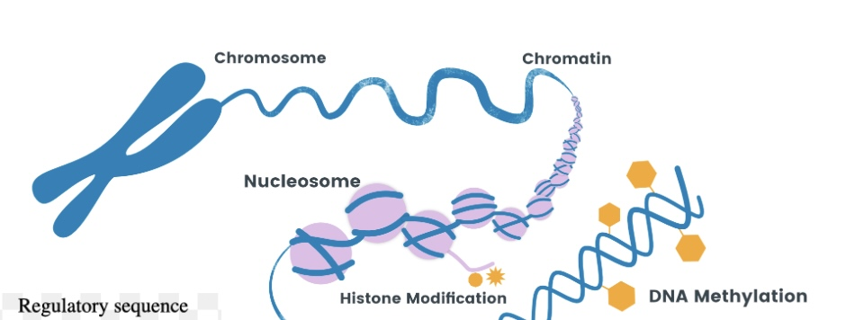
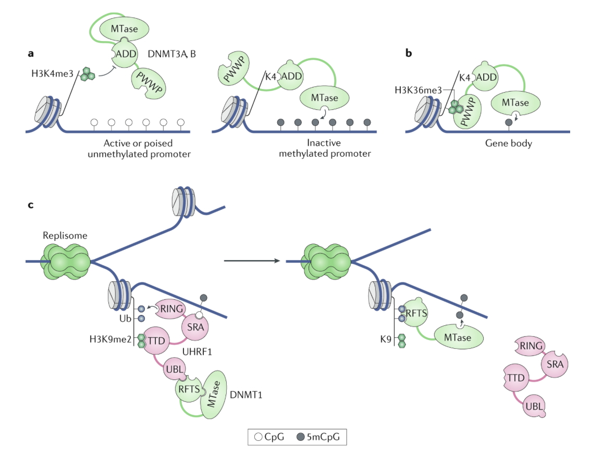

# DNA Methylation Age Prediction

 

 

 

## Project Overview
DNA methylation is a genomic process used to
regulate the expression of a given gene. The
application of methylation clock models to
predict age can be used to address health
assessments as well as other areas of interest
such as cancer research; however, these are
challenging to build due to the vast amount of
genetic information that can be attributed to a
given individual. As a result, we must use
methods that are able to address the curse of dimensionality 
that arises due to the nature ofthis high-dimensional problem.

## Project Methodology

For this project,
I employ elastic net, boosted trees and random
forest as potential avenues to accurately model
the relationship between a collection of
approximately 500,000 CpG sites and the age of
a given individual, and compare the strengths
and weaknesses of each approach for their
success as a methylation clock.  

## Project Paper
Here is a link to my project paper covering an overview of the project background, methods, and results:
https://github.com/jameshopham/DNA-Methylation-Age-Prediction/blob/main/Hopham_James_Project_Report_BST432.pdf

### Built With

This project was built with the following technologies:

- R
- glmnet
- doParallel
- xgboost
- ranger

## Reference
Here are some specific links that may be helpful.

Integrating Epigenetic and Phenotypic Features for Biological Age Estimation in Cancer
Patients via Multimodal Learning: https://arxiv.org/pdf/2511.07219  
DNA methylation-based biomarkers and the epigenetic clock theory of aging: https://www.nature.com/articles/s41576-018-0004-3#Sec21  

## Contact

If you have any questions or suggestions, feel free to reach out to me:

- Connect with me on LinkedIn:

    
     
    <a href="https://www.linkedin.com/in/james-hopham-2440352a5/" target="_blank">James Hopham</a>

